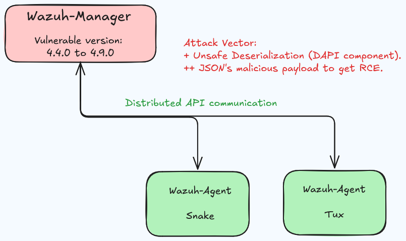
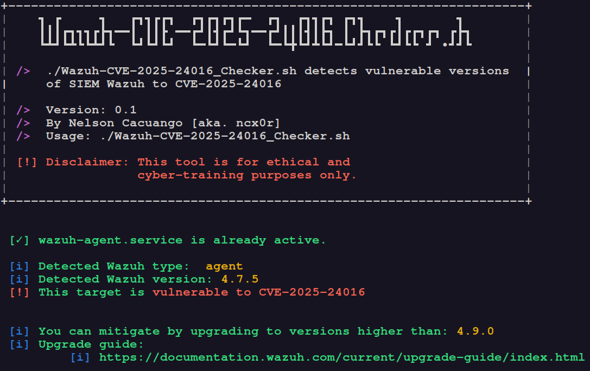
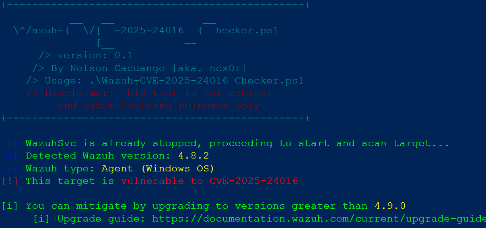

# Evil Wazuh Lab. (EWL)
EWL is a project that pretends to provide a controlled environment pointing  to cyber-training (initially from a "Home Lab and CTF style" perspective, but future work will seek real-world applicability) and it is based on the recently vulnerability discovered on Wazuh, specifically the CVE-2025-24016.

EWL is inspired on this highly detailed post, [CVE-2025-24016: Unsafe Deserialization Vulnerability in Wazuh Leading to Remote Code Execution](https://cvereports.com/cve-2025-24016-unsafe-deserialization-vulnerability-in-wazuh-leading-to-remote-code-execution/), so Huge Thanks and Credits to Master Robert Morgan.

## EWL's Network Diagram:

- Lab. machines still under testing... coming soon will shared.

## EWL's Attack Scenario:
- **Reconnaissanse** 
The attacker identifies a vulnerable Wazuh server (version 4.4.0 to 4.9.0). 
-   **Authentication** 
The attacker obtains valid API credentials, either through default credentials, credential stuffing, or other means.
-   **Payload Injection** 
The attacker sends a malicious JSON payload to the `run_as` endpoint, as shown in the PoC above.
-   **Code Execution** 
The `as_wazuh_object` function deserializes the payload and executes the attacker-controlled code.
-   **System Compromise** 
The attacker gains control of the Wazuh server and can perform various malicious activities, such as data theft, service disruption, or lateral movement within the network.

## EWL's. works achieved: 
### Reconnaissanse stage:
- **Wazuh-CVE-2025-24016_Checker.sh**
This tool written on Bash has capability to scan target based on Linux OS  and determine if it is or not vulnerable to CV-2025-24016.

- **Wazuh-CVE-2025-24016_Checker.ps1**
This tool written on PowerShell has capability to scan target based on Linux OS  and determine if it is or not vulnerable to CV-2025-24016.

- **Wazuh-CVE-2025-24016_Checker.py**
This tool written on Python will have capability to... (on progress)

### Authentication stage:
- On progress
### Payload Injection stage:
- On progress
### Code Execution stage:
- On progress
### System Compromise stage:
- On progress

## TO-DO: 
- Extend scanner's capability to scan based on IP address. 
- Build exploit Proof of Concept.Com. | D[W.Ag-Tux  ]

